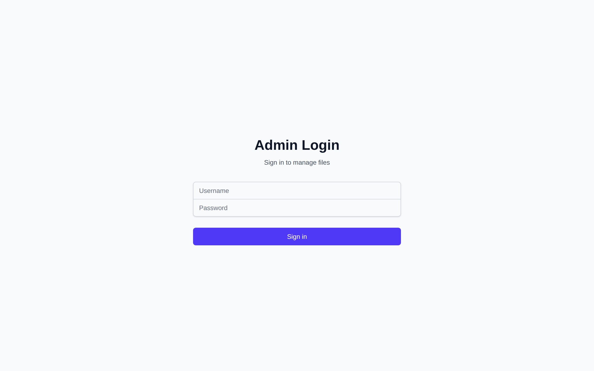
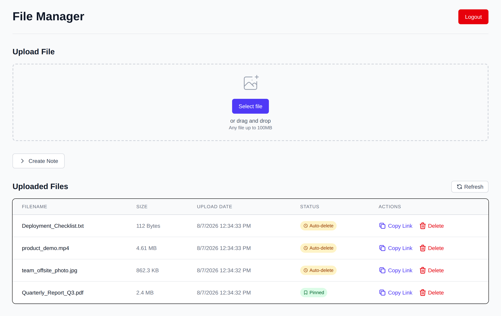
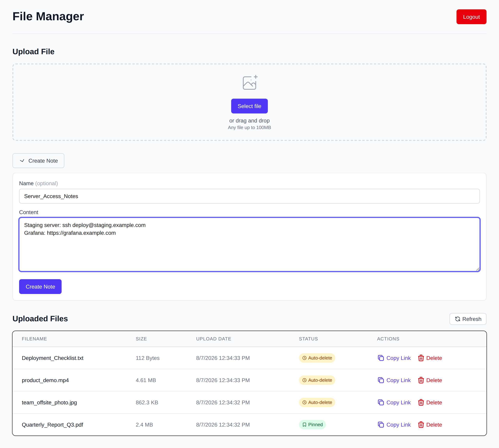
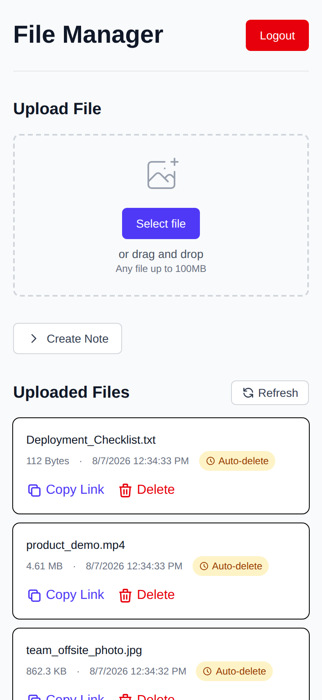

# File Share

[](https://github.com/8exgh/share_files/actions/workflows/playwright.yml)

<!-- test-results:start -->
**✅ 15 / 15 tests passing** — dockerized Playwright run on 2026-08-15 in 14s ([latest run](https://github.com/8exgh/share_files/actions/runs/31857587822))
<!-- test-results:end -->

Created by **Sean Bennett**.

A self-hosted, anonymous file sharing app. A single authenticated admin uploads files (or jots down quick notes); anyone with the direct link can download them — no account, no login. Files are addressed by UUID so links can't be guessed, and everything auto-deletes after an hour unless you pin it.

Built with Next.js (App Router), TypeScript, Tailwind CSS, and iron-session.

## Features

- **Admin-only uploads** — single admin account, session-based auth with secure HTTP-only cookies
- **Anonymous downloads** — share links (`/f/{uuid}/{filename}`) work without authentication
- **Drag-and-drop uploads** — streamed to disk, so large files don't balloon memory
- **Inline notes** — type or paste text and it becomes a shareable `.txt` file
- **Auto-delete** — uploads expire after 1 hour (checked every 30 minutes); pin a file to keep it
- **Copy-to-clipboard share links**, one click from the file list
- **Responsive UI** — table on desktop, cards on mobile
- **Request logging** — every request logged with Cloudflare-aware client IPs

## Screenshots

### Admin login

The only page an unauthenticated visitor ever sees.



### Dashboard

Upload files, create notes, and manage everything in one place. Each file shows its auto-delete status — the amber badge means it expires an hour after upload, the green one means it's pinned and kept forever.



### Inline notes

Need to share a snippet rather than a file? Expand **Create Note**, type or paste, and it's saved as a shareable text file.



### One-click share links

**Copy Link** puts the anonymous download URL on your clipboard.


### Mobile

The file table becomes cards on small screens.



## Getting started

```bash
cd file-share
npm install
```

Create `file-share/.env.local`:

```
SESSION_SECRET=<minimum-32-characters>
ADMIN_USERNAME=admin
ADMIN_PASSWORD=<secure-password>
UPLOAD_DIR=./uploads
```

Then:

```bash
npm run dev    # development server on http://localhost:3000
npm run build  # production build
npm run start  # production server
```

## Testing

End-to-end tests are written with [Playwright](https://playwright.dev) and cover login/logout, session persistence, upload, anonymous download, notes, copy-link, auto-delete pinning, deletion, and 404 handling for bad links.

```bash
cd file-share
npm run test          # runs against a dev server it starts itself
npm run test:report   # open the HTML report
npm run screenshots   # regenerate the README screenshots in docs/screenshots/
```

### Dockerized test run

CI runs the same suite against the **production Docker image**: `docker-compose.test.yml` starts the app container (built from `file-share/Dockerfile`) and a Playwright container that shares its network namespace, then runs the tests against `http://localhost:3000`.

```bash
docker compose -f docker-compose.test.yml build
docker compose -f docker-compose.test.yml run --rm tests
docker compose -f docker-compose.test.yml down -v
```

The HTML report and JSON results land in `test-artifacts/`.

## CI

- [`playwright.yml`](.github/workflows/playwright.yml) — on every push and PR, builds the Docker images, runs the dockerized Playwright suite, uploads the HTML report as an artifact, and refreshes the test-results line at the top of this README.
- [`build-and-push.yml`](.github/workflows/build-and-push.yml) — on push to `main`, builds the production image, pushes it to GHCR, and triggers deployment.

## Deployment

The production image is a multi-stage Alpine build running the Next.js standalone server behind `dumb-init` as a non-root user. See [DEPLOYMENT.md](DEPLOYMENT.md) for details, including the uploads volume and request logging.
